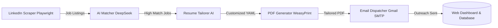

# 🤖 JobHunt-Automation — AI-Powered 1-Click Job Application Engine

[](https://jobhunt-automation.onrender.com)
[](https://python.org/)
[](https://deepseek.com/)
[](https://playwright.dev/)
[](https://flask.palletsprojects.com/)

**JobHunt-Automation** is an intelligent, automated end-to-end job application system designed to take the manual grind out of job hunting. 

With a single trigger, it searches and scrapes active job listings on LinkedIn, evaluates job descriptions against your master resume profile using AI, dynamically rewrites and tailors your resume for maximum ATS compatibility, compiles a pixel-perfect PDF, and sends direct, personalized outreach emails to recruiters.

---

## 🌟 Key Features

* **🔍 Automated LinkedIn Job Scraping**: Uses Playwright headless browser automation to discover active job postings based on target titles, locations, and experience levels without triggering rate limits.
* **🧠 AI Match Scoring**: Analyzes job requirements against your skills, projects, and work history using DeepSeek AI to generate a compatibility percentage score.
* **✍️ Dynamic Resume Customization**: Automatically tailors resume bullet points, summary statements, and keyword density for each specific role to ensure high ATS (Applicant Tracking System) ranking.
* **📄 Pixel-Perfect PDF Generation**: Converts customized YAML resume data into a clean, modern PDF document using WeasyPrint.
* **📧 Automated Recruiter Outreach**: Drafts personalized cover emails and directly emails recruiters via Gmail SMTP with the tailored resume attached.
* **📊 Web Dashboard**: Monitor active scraping runs, view matched job listings, inspect generated resumes, and manage application statuses in real time.

---

## 🏗️ System Workflow



---

## 📁 Repository Structure

```text
JobHunt-Automation/
├── app.py                      # Flask backend & dashboard API
├── run.py                      # Main automation pipeline orchestrator
├── config.yaml                 # Job search filters, keywords & app settings
├── requirements.txt            # Python dependencies
├── Procfile                    # Render / production process declaration
├── data_folder/
│   ├── plain_text_resume.yaml  # Master resume profile (education, experience, skills)
│   └── secrets.yaml            # Private API keys and email credentials
├── frontend/                   # React web dashboard interface
├── templates/                  # HTML templates & email formats
└── output/                     # Generated tailored resumes & application logs
```

---

## 🚀 Quick Start Guide (For First-Timers)

### 1. Prerequisites
* [Python 3.10+](https://www.python.org/downloads/)
* [Git](https://git-scm.com/)
* A [DeepSeek AI API key](https://platform.deepseek.com/)
* A Google Account with an [App Password](https://support.google.com/accounts/answer/185833) enabled (for automated emailing)

---

### 2. Clone the Repository
```bash
git clone https://github.com/kaustubh12022/JobHunt-Automation.git
cd JobHunt-Automation
```

---

### 3. Create a Virtual Environment & Install Dependencies
```bash
# Create virtual environment
python -m venv venv

# Activate on Windows:
.\venv\Scripts\activate

# Activate on macOS/Linux:
source venv/bin/activate

# Install requirements
pip install -r requirements.txt

# Install Playwright browser drivers
playwright install chromium
```

---

### 4. Configure Your Resume & Credentials

1. **Add Your Master Resume**: Edit `data_folder/plain_text_resume.yaml` with your personal details, education, experience, and skill set.
2. **Configure Secrets**: Create or edit `data_folder/secrets.yaml`:
   ```yaml
   deepseek_api_key: "your_deepseek_api_key_here"
   email: "your_email@gmail.com"
   email_password: "your_16_character_gmail_app_password"
   ```
3. **Configure Job Preferences**: Edit `config.yaml` to specify target job titles (e.g. `Full Stack Developer`, `Software Engineer`), locations, and minimum match score thresholds.

---

### 5. Run the Application

**Option A — Run the Full Automation Pipeline:**
```bash
python run.py
```

**Option B — Launch the Web Dashboard:**
```bash
python app.py
```
Open your browser at **`http://localhost:5000`** to manage runs visually.

*(Windows Shortcut: You can also double-click `Start_AutoApply.bat` on your desktop to launch both the server and dashboard automatically).*

---

## 🌐 Production Deployment (Render)

The project is pre-configured for deployment on **Render**:
* **Runtime**: Python 3.10+
* **Build Command**:
  ```bash
  pip install -r requirements.txt && cd frontend && npm install && npm run build
  ```
* **Start Command**:
  ```bash
  gunicorn app:app --workers 2 --timeout 120
  ```

---

## 📄 License

This project is licensed for personal and educational use.
