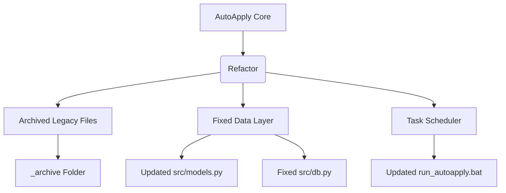

# AutoApply Update Log (July 8, 2026)

## [2026-07-08] - Phase 3 Modular Test Lab Implemented
- **Test Lab Architecture**: Deconstructed the monolithic test pipeline into 6 granular stages (`Scrape → Filter → Score → Tailor → Render → Validate`).
- **Token Efficiency**: Introduced **Database Sampling**, pulling real `tracked_jobs` dynamically from Supabase to feed isolated tests. E.g., testing the PDF rendering engine now costs **0 AI tokens** because it uses cached jobs. Testing the Scorer costs ~150 tokens instead of scraping 100 jobs first.
- **Dynamic Configuration**: Added a dedicated `/test-lab` React UI where users can independently select stages and set custom sample counts (e.g., Score exactly 3 jobs, Tailor 2). Also provided detailed results showing which job resumes were generated for.
- **Backend Refactor**: Extracted testing logic into a new `src/test_engine.py` orchestrator without modifying the existing production pipeline (`app.py`).

## High Priority Suggestions Implemented

### 1. Legacy Code Archived
To reduce cognitive load and clean up the active codebase, all unused inherited files from the original AIHawk project have been moved into a new `_archive` folder.

| Status | File Path / Directory | Description |
|---|---|---|
| 📦 Moved | `config.py` | Legacy configuration |
| 📦 Moved | `src/job.py` | Legacy Job dataclass |
| 📦 Moved | `src/jobContext.py` | Legacy Context |
| 📦 Moved | `src/job_application_saver.py` | Local saving logic |
| 📦 Moved | `src/logging.py` | Legacy Logging |
| 📦 Moved | `src/utils/constants.py` | String constants |
| 📦 Moved | `src/utils/chrome_utils.py` | Selenium utils |
| 📦 Moved | `src/resume_schemas/` | Legacy schema definitions |
| 📦 Moved | `src/libs/llm_manager.py` | Legacy LLM manager |
| 📦 Moved | `src/libs/resume_and_cover_builder/` | Resume generator |
| 📦 Moved | `src/prompts/` | External prompts |
| 📦 Moved | `templates/dashboard.html` | Old server rendered dashboard |
| 📦 Moved | `data_folder/work_preferences.yaml` | Legacy preferences |
| 📦 Moved | `data_folder/secrets.yaml` | Legacy secrets |
| 📦 Moved | `assets/AIHawk.png`, `laboro.png`, `resume_schema.yaml` | Legacy branding and definitions |

### 2. Database Persistence Gaps Fixed
Fixed the bug where dynamically attached job data was ignored during database insertion.

| File | Change | Flag |
|---|---|---|
| `src/db.py` | Updated `save_pipeline_results()` to insert missing DB columns into `tracked_jobs`: `source`, `extracted_requirements`, `is_testing_role`, and `tailored_resume`. | 🗄️ Persistence |
| `src/db.py` | Used `getattr(job, 'field', None)` to safely handle skipped fields without crashing. | 🛡️ Error Handling |

### 3. Formalized Job Dataclass
Removed reliance on dynamic attributes by explicitly defining AI and scraping metadata fields on the `Job` model.

| File | Change | Flag |
|---|---|---|
| `src/models.py` | Added `extracted_requirements: Optional[str] = None` | 📝 Type Safety |
| `src/models.py` | Added `is_testing_role: Optional[bool] = None` | 📝 Type Safety |
| `src/models.py` | Added `unique_id: Optional[str] = None` | 📝 Type Safety |
| `src/models.py` | Added `tailored_resume: Optional[dict] = None` | 📝 Type Safety |

### 4. Corrected Execution Script Paths
Fixed an incorrect hardcoded file path in the main execution script that would cause Windows Task Scheduler to fail.

| File | Change | Flag |
|---|---|---|
| `run_autoapply.bat` | Changed `cd "C:\Users\kalek\OneDrive\Desktop\AutoApply"` to `cd "C:\Users\kalek\OneDrive\Desktop\Projects\AutoApply"` | ⚙️ Orchestration |

---

## Change Flow Diagram

## Medium & Low Priority Suggestions Implemented

### 1. Cloud PDF Storage & Automated Cleanup
Integrated Supabase Cloud Storage to store generated resumes instead of relying purely on local storage. Added a robust cleanup mechanism to ensure Free Tier limits are never exceeded.

| Component | Change | Flag |
|---|---|---|
| `setup_db.py` | Added SQL instructions to create a `resumes` bucket. | 🗄️ Storage |
| `src/db.py` | Updated `save_pipeline_results` to upload PDFs to Supabase Storage and capture the public URL instead of the local path. | ☁️ Cloud Sync |
| `src/db.py` | Added `cleanup_old_pdfs()` which automatically deletes PDFs older than 30 days from the bucket **only** if their status is `generated`, `rejected`, or `custom`. | 🧹 Cost Control |
| `app.py` | Updated `/api/resume/<job_id>` to redirect to the Supabase public URL. | 🔄 Routing |

### 2. Consolidated Utilities & Configs
Removed duplicate logic across the codebase.

| Component | Change | Flag |
|---|---|---|
| `src/config_loader.py` | Centralized `get_human_date_str()` function. | ♻️ DRY Code |
| `src/pdf_generator.py` | Wired `config['resume']['max_pages']` to selectively disable CSS scaling when multi-page output is permitted. | ⚙️ Configs |
| `app.py`, `run.py`, `sheet_generator` | Updated imports to use the centralized date utility. | ♻️ Refactor |

### 3. JD Caching & Cost Tracking
Implemented cost reduction measures for the AI pipeline.

| Component | Change | Flag |
|---|---|---|
| `setup_db.py` | Created a `jd_cache` table and added `tokens_used` to `pipeline_runs`. | 🗄️ Schema |
| `src/scorer.py` | Intercepts JD scoring requests, checks `jd_cache` by URL, and skips DeepSeek entirely if the job was previously scored. | ⚡ Performance |
| `src/ai_engine.py` | Extracts exact `usage.total_tokens` from OpenAI response headers. | 💰 Cost Tracking |

### 4. AI Prompt Externalization
Hardcoded system prompts are now manageable text files.

| Component | Change | Flag |
|---|---|---|
| `src/prompts/` | Created `scoring_prompt.txt` and `tailoring_prompt.txt`. | 📄 Prompts |
| `src/ai_engine.py` | Implemented `_get_prompt()` to load from files at runtime and inject dynamic variables. | 🧠 AI Logic |

### 5. Tracker UX & Cross-Platform Fixes
Enhanced the web dashboard and CLI reliability.

| Component | Change | Flag |
|---|---|---|
| `frontend/src/index.css` | Added `@media (max-width: 768px)` rule to dynamically stack the Kanban board on mobile devices. | 📱 Responsive |
| `Tracker.jsx` | Integrated `supabase.channel()` to subscribe to `postgres_changes` for real-time Kanban board updates. | 🔄 Real-Time |
| `KanbanBoard.jsx` | Unified the `offer` and `offer_received` statuses to eliminate hacky frontend logic. | 💅 UX |
| `app.py` | Wrapped `sys.stdout.reconfigure()` in a `sys.platform == 'win32'` check for cross-platform stability. | 🌍 OS Support |

### 6. Automated Testing Suite
Introduced isolated mock tests.

| Component | Change | Flag |
|---|---|---|
| `tests/test_components.py` | Created a PyTest suite that mocks the AI API and verifies `is_relevant_jd`, `strip_boilerplate`, and `get_human_date_str`. | 🧪 Testing |

## Phase 3 Tailoring Engine Upgrade & Fixes

### 1. Model Configuration Update
Swapped the model to `deepseek-v4-pro` and enforced strict JSON output formats.
| Component | Change | Flag |
|---|---|---|
| `src/ai_engine.py` | Hardcoded `deepseek-v4-pro` and added `response_format={"type": "json_object"}` inside `call_ai_tailoring_async`. | 🧠 AI Upgrade |

### 2. System Prompt Replacement
Replaced old prompt with dynamic JSON array structures and dropped hardcoded values.
| Component | Change | Flag |
|---|---|---|
| `src/prompts/tailoring_prompt.txt` | Rewrote tailoring system prompt to use purely dynamic placeholders and output `description_bullets` as a flat array. | 📄 Prompts |

### 3. Delta Merge & Rendering Logic
Adjusted merge code and HTML templates to parse the new Schema format smoothly.
| Component | Change | Flag |
|---|---|---|
| `src/resume_tailor.py` | Updated merge logic to correctly map the new delta output keys (`tailored_experience` and `tailored_projects`). | 🔄 Refactor |
| `templates/resume_template.html` | Updated `render_projects()` macro to support `description_bullets` while retaining backwards compatibility. | 💅 UI / PDF |

### 4. Missing Skills Bug Fix
Resolved the issue where existing skills like JavaScript were reported as missing.
| Component | Change | Flag |
|---|---|---|
| `src/prompts/scoring_prompt.txt` | Added a CRITICAL instruction to cross-check `missing_skills` against all sections of the candidate's Master Resume. | 🧠 AI Logic |
| `data_folder/plain_text_resume.yaml` | Added TypeScript to the candidate's Core Languages skills section. | 📝 Profile |

### 5. Validation Test Suite
Created unit tests and upgraded the integration testing pipeline.
| Component | Change | Flag |
|---|---|---|
| `tests/test_phase3_upgrade.py` | Built a new offline test suite to ensure prompt variables are correct and cross-checks are present. | 🧪 Testing |
| `test_pipeline.py` | Added validation to flag missing skills that are actually present in the generated resume (false positive detection). | 🧪 Testing |

## Frontend UI Changes

### 1. Persistent Snapshot Layout
Updated the React Dashboard to capture and persist the intermediate outputs of Phase 2 (Scoring) and Phase 3 (Tailoring). Replaced the volatile individual phase views (`TailorView`, `SavingView`, `CompleteView`) with a unified dual-pane architecture.

| Component | Change | Flag |
|---|---|---|
| `frontend/src/pages/Dashboard.jsx` | Created `PersistentSnapshotView` featuring a split layout (Module A: Scoring Audit, Module B: Tailoring Audit). | 🎨 UI Architecture |
| `frontend/src/pages/Dashboard.jsx` | Implemented global completion banner that displays summary stats when Phase 5 finishes without clearing the tables. | 💅 UX |
| `frontend/src/pages/Dashboard.jsx` | Configured rendering logic so the snapshot layout takes over the moment `phase` transitions to `tailoring`, `saving`, or `done`. | 🔄 State Management |

## Architecture Refactor & PWA Tracker Optimization

### 1. Unified ID System & Database Integrity
Resolved the Supabase UUID crash (`22P02`) that prevented saving pipeline results.
| Component | Change | Flag |
|---|---|---|
| `src/models.py`, `src/scraper.py` | Added explicit `id` to the `Job` dataclass and generate a true UUID at scraping time. | 🗄️ Architecture |
| `src/scorer.py`, `src/db.py` | Track jobs using the true `job.id` through the entire pipeline and persist it to Supabase explicitly. | 🐛 Bug Fix |
| `src/pdf_generator.py` | Appended the short UUID (`job.id[:6]`) to PDF filenames to prevent name collisions. | 📄 Output |

### 2. Dashboard UX Enhancements
Added detailed parameter transparency during the scraping phase.
| Component | Change | Flag |
|---|---|---|
| `src/scraper.py`, `app.py` | Overhauled `on_cycle_start` to emit and parse a rich dictionary containing Roles, Locations, Job Types, and Platforms. | 🔄 Backend Sync |
| `frontend/src/pages/Dashboard.jsx` | Upgraded `ScanView` with a persistent 'CURRENT SEARCH PARAMETERS' alert box. | 💅 UX |
| `frontend/src/pages/Dashboard.jsx` | Removed the reliance on `unique_id` for viewing PDFs, migrating fully to `s.id`. | 🔗 Routing |
| `frontend/src/pages/Dashboard.jsx` | Added a "Run Again" button to the Global Completion Banner that resets the pipeline to the configuration screen. | 💅 UX |

### 3. Decommissioned Legacy Notification Flow (Excel/Email)
Fully deprecated the daily Email and local Excel generation in favor of the PWA Application Tracker acting as the single source of truth.
| Component | Change | Flag |
|---|---|---|
| `app.py`, `run.py` | Removed all `src.email_sender` and `src.sheet_generator` logic. Refactored the end of the pipeline to simply write to Supabase. | 🗑️ Deprecation |

### 4. Tracker PWA Push Notification
Implemented a local notification system to alert users when a background pipeline finishes.
| Component | Change | Flag |
|---|---|---|
| `frontend/src/pages/Tracker.jsx` | Built a `NewRunNotification` modal that queries Supabase for the most recent run and compares it against `localStorage['last_seen_run']`. | 🔔 Notifications |
| `frontend/src/pages/Tracker.jsx` | Populates the modal with top-level stats and the shortlisted jobs (+ match scores) dynamically. | 💅 UX |

## Minor Fixes & Pipeline Enhancements

### 1. Fixed Silent Dataclass Crash
Resolved a critical silent failure where the background thread crashed immediately after the scraping phase, preventing jobs from reaching the database, generating PDFs, and appearing in the Tracker.
| Component | Change | Flag |
|---|---|---|
| `src/models.py` | Moved the `id: Optional[str] = None` field below required fields (e.g., `title: str`). This fixes a `TypeError: non-default argument follows default argument` in the Python `dataclass`. | 🐛 Bug Fix |

### 2. Reset Scraping Counter
Fixed an issue where the "Found Overall" job counter accumulated across multiple runs without resetting.
| Component | Change | Flag |
|---|---|---|
| `app.py` | Added `pipeline_state["scan"]["total_found"] = 0` to the initialization block of `run_pipeline()`. | 🔄 State Management |

### 3. Randomized Test Combinations
Ensured that Test Mode explores different search parameters rather than scraping the exact same 5 combinations every time.
| Component | Change | Flag |
|---|---|---|
| `src/scraper.py` | Applied `random.shuffle(combinations)` before slicing the first 5 elements when `test_mode` is enabled. | 🧪 Testing |

### 4. Resume Generation Refinements & ATS Optimization
Implemented targeted filtering for the Skills section to prevent resume overflow and ensure high ATS relevance.
| Component | Change | Flag |
|---|---|---|
| `data_folder/plain_text_resume.yaml` | Updated the candidate's core GPA to `7.70 CGPA`. | 📝 Data Update |
| `src/prompts/tailoring_prompt.txt` | Overhauled the prompt to require a `tailored_skills` array (max 12 skills), instructing DeepSeek to aggressively filter the 30+ master skills down to only the most relevant technologies for the specific Target Role. Also enforced that both Experience and Projects must be strictly rewritten through the role lens. | 🧠 AI Prompting |
| `src/resume_tailor.py` | Updated the JSON delta merge logic to parse and inject the new `tailored_skills` array dynamically into the output JSON. | 🔄 Backend Logic |
| `templates/resume_template.html` | Slightly reduced vertical body padding to `0.40in` and `line-height` to `1.35` to guarantee the PDF remains strictly 1 page even with denser bullet points, preventing awkward overflow. | 💅 UI/CSS |

### 5. Phase 3 Context Starvation Fix
Resolved the critical data degradation issue where Phase 3 (Tailoring) was only receiving a compressed 15-word keyword list instead of the full Job Description, and replaced brittle regex filtering with an AI-native protocol.
| Component | Change | Flag |
|---|---|---|
| `src/resume_tailor.py` | Routed the complete `job.description` + Phase 2 Priority Signals into the user prompt, giving the Tailoring AI full context. | 🧠 AI Logic |
| `src/prompts/tailoring_prompt.txt` | Implemented a strict `COGNITIVE PROCESSING PROTOCOL` in the system prompt to force the AI to self-filter noise (HR boilerplate) and prioritize core engineering signals. | 📄 Prompts |
| `src/ai_engine.py` | Extracted and logged `prompt_cache_hit_tokens` and `prompt_cache_miss_tokens` to explicitly prove that our Top-of-Prompt System Caching strategy remains fully intact and unbroken. | 💰 Cost Tracking |

### 6. Pipeline Stability & Cache Optimization
Fixed several downstream bugs discovered during the caching test run.
| Component | Change | Flag |
|---|---|---|
| `src/scorer.py`, `src/resume_tailor.py` | **Smart Cache Warming:** Restructured `asyncio.gather` so the first job is processed sequentially to populate DeepSeek's prefix cache. The remaining jobs are then fired concurrently, resulting in near 100% cache hits for large batches instead of mass cache misses. | ⚡ Performance |
| `src/ai_engine.py` | Resolved the `Event loop is closed` error by ensuring the `AsyncOpenAI` client is properly closed inside a `finally` block after API execution. | 🐛 Bug Fix |
| `src/db.py` | Updated Supabase initialization to fallback to `SUPABASE_SERVICE_ROLE_KEY` if available. This fixes the `403 Unauthorized (RLS Policy)` error when uploading generated PDFs to the Storage bucket. | 🔐 Auth |

### 7. Dashboard Routing & Output Folder Organization
Fixed a critical routing conflict in the Flask backend that prevented the Application Tracker SPA from loading, and organized local PDF outputs into dedicated timestamped subfolders.
| Component | Change | Flag |
|---|---|---|
| `app.py` | Removed `static_url_path=''` from the Flask initialization, which was overriding the `@app.route('/<path:path>')` catch-all route and causing `404 Not Found` errors when navigating to `/tracker`. | 🐛 Bug Fix |
| `app.py`, `run.py` | Updated the output folder generation logic to separate PDFs into `main pipeline/20july-16:35` or `test/20july-16:35` based on the execution mode and current time. | 📂 File System |
| `run_autoapply.bat` | Rewrote the batch script from headless Task Scheduler mode to interactive mode. It now automatically opens the default web browser to `http://127.0.0.1:5000` and launches the Flask dashboard. | ⚙️ Orchestration |
